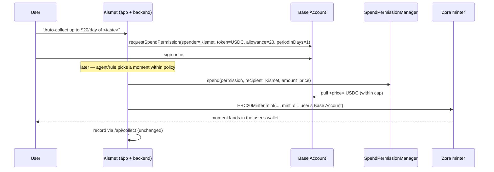

# Budgeted Collecting on Base — Capability Research & Wiring

> Status: **RESEARCH / DESIGN** (no code). Answers: *can a user set a budget so an
> agent collects for them without a tap each time, and how would we wire it?*
> Short answer: **yes — via Base Account Spend Permissions (GA), wired in Kismet,
> not through Base MCP.**
>
> Sources are mid‑2026 Base/Coinbase docs. `docs.base.org`, `blog.base.dev`, and
> `coinbase.com` block automated fetch; technical facts below come from the
> authoritative `coinbase/spend-permissions` repo and the `@base-org/account` SDK,
> cross‑checked with Base docs search results. **Verify the contract address and
> SDK signatures against live docs before implementing.**

---

## 1. The three current Base primitives

### 1.1 Spend Permissions — the budget primitive (GA, audited)

A user signs **once** to let a **spender** pull a token up to an allowance per
recurring period. Enforced on‑chain.

- **Contract:** `SpendPermissionManager`, a singleton at
  `0xf85210B21cC50302F477BA56686d2019dC9b67Ad` on Base (and Ethereum, OP, Arbitrum,
  Polygon, Zora, BSC, Avalanche). Audited by Spearbit/Cantina (2024).
- **`SpendPermission` struct:** `{ account, spender, token, allowance, period,
  start, end, salt, extraData }`.
- **Tokens:** **native ETH and ERC‑20 (e.g. USDC)** on a recurring period.
- **Grant:** EIP‑712 signature; submitted via `approveWithSignature` (batch‑prepended
  to the first spend) or a direct `approve`.
- **Spend:** the spender calls `spend(permission, recipient, amount)`; the manager
  checks approval + the per‑period allowance and transfers from the user's account.
- **Accounting:** cumulative spend tracked per period; resets at each new period;
  bounded by `start`/`end`. **Revocable** anytime via `revoke()`.
- **SDK — `@base-org/account/spend-permission`:**
  - `requestSpendPermission({ account, spender, token, chainId, allowance, periodInDays })`
  - `fetchPermissions({ account, chainId, spender, provider })`
  - `prepareSpendCallData(permission, amount)` (calldata for the spender to execute)
  - `getPermissionStatus(permission)` (validity + remaining balance)

> Plain English: *"0x<spender> can spend 20 USDC per day for 30 days."* This is the
> exact "trading bot / subscription" pattern Base documents — applied to collecting.

### 1.2 Sub Accounts — Spend Permissions + hierarchy + session keys

`Sub Accounts = Spend Permissions + hierarchical ownership + the
`wallet_addSubAccount` RPC`. The app provisions a **siloed sub‑account under the
user's Base Account**; a **session key** (a scoped signer — time‑bound and/or
function‑bound) the app holds can transact for it; **Auto Spend Permissions** fund
it from the parent and make transactions **popup‑less after one approval**. Base
explicitly pitches this for *"provision AI assistants with their own siloed smart
accounts, able to spend with fine‑grained permissions."*

### 1.3 CDP Agentic Wallets (launched Feb 11, 2026)

A separate model: the **agent gets its own MPC‑secured wallet** with **session
caps, per‑transaction limits, gasless settlement on Base, and native x402**. The
policy engine enforces token allowlists (e.g. "up to 100 USDC/session, zero ETH").
Base MCP's x402 `agentWalletId` parameter ties to this. Different trust model — the
agent holds a wallet *you fund*, vs. spending from the user's own Base Account.

---

## 2. The key finding about Base MCP

**Base MCP today is approval‑per‑action.** Every write tool (`send`, `swap`, `sign`,
`send_calls`, x402) returns `{approvalUrl, requestId}`; the skill's references are
`install / tone / approval-mode / batch-calls / custom-plugins` — there is **no
spend‑permission or budget tool**. The only budget hook in the MCP surface is x402's
`agentWalletId` (a CDP agentic wallet, scoped to *paying x402 endpoints*, not to
arbitrary collects).

**Therefore budgeted collecting is not a Base MCP feature.** We wire it in Kismet
with the Base Account SDK, and it executes through **Kismet's backend (the spender)**
— not through the agent's per‑action `send_calls`. The agent's role shifts from
"prepare each tx for a tap" to "decide what to collect within the user's budget."

---

## 3. Recommended wiring — Spend Permissions, Kismet as spender

The minimal first version that delivers "set a collecting budget":

1. **Set budget (one signature):** Kismet UI → `requestSpendPermission({ account,
   spender: KISMET_OPERATOR, token: USDC_BASE, allowance, periodInDays })`.
2. **Decide (no signature):** the agent (or a standing rule) picks moments that pass
   the **Kismet policy** (see §4). Reuse our `prepare-collect` logic for the price +
   eligibility + calldata.
3. **Execute (no signature):** the operator `spend()`s the price from the user's
   account (capped on‑chain), then mints with `mintTo = user's Base Account`. USDC →
   `[spend, approve(ERC20Minter), mint]`; ETH → `[spend, mint{value}]`.
4. **Record:** the existing on‑chain‑verified `/api/collect` (unchanged).
5. **Manage:** `getPermissionStatus` shows the remaining daily allowance; the user
   `revoke()`s anytime.

The same `prepare-collect` calldata and the same record route power both the
per‑action (Base MCP, 1 tap) path and this budgeted path — only the **executor**
(operator vs the user's wallet) and the **authorization** (one‑time permission vs
per‑tx approval) differ.

---

## 4. Constraints & decisions (what makes this safe and correct)

- **Per‑token budget.** A USDC permission covers USDC (`erc20Mint`) collects; an ETH
  permission covers ETH (`fixedPrice`) collects + gas. **Start USDC‑only** (matches
  stablecoin/x402 norms, simplest); add ETH later. If a target is ETH‑priced and the
  user only set a USDC budget, skip it and surface "needs an ETH budget."
- **Spend Permissions cap *dollars*, not *which contracts***. The manager enforces
  how much of a token the spender can pull — it does **not** restrict the call. So
  the on‑chain budget is the dollar cap; the **"what to collect" policy is
  Kismet‑enforced** and must be explicit and user‑set:
  - allowed collections / creators (allowlist),
  - max unit price per collect,
  - max items per period (daily count),
  - optional taste filter (the discovery layer).
- **Spender trust.** `SpendPermissionManager` enforces the cap, **not** that the mint
  happened. In the backend‑spender model the user trusts Kismet to deliver the NFT
  after pulling funds (bounded by the cap, revocable, our reputation; we can also
  publish each `spend → mint` pair for verification). The **Sub Account** model (§1.2)
  removes most third‑party trust — execution happens under the user's own
  sub‑account — at the cost of more integration; it's the natural v2.
- **Gas.** The operator/sub‑account pays gas. Use a Base paymaster / CDP sponsorship
  for a gasless feel.
- **Recipient.** `mintTo` is always the user's Base Account (our calldata builders
  already take `mintTo`), so the NFT lands with the user even though the operator
  submits.
- **Revocation + transparency.** Surface remaining budget, a per‑collect log, and a
  one‑tap revoke. Treat the budget as a standing authorization the user can see and
  kill at any moment.

---

## 5. How it complements what we shipped

| | Per‑action (today, Base MCP) | Budgeted (this proposal) |
| --- | --- | --- |
| Authorization | one tap per collect | **one signature, then none** within the cap |
| Executor | the user's Base Account (`send_calls`) | Kismet operator (or the user's sub‑account) |
| Best for | deliberate, occasional buys | standing intent — "auto‑collect drops up to $X/day" |
| Enforcement | the user reviews each tx | `SpendPermissionManager` cap + Kismet policy |
| Shared | **same `prepare-collect` calldata, same `/api/collect` record** | — |

This is the difference between "collect this for me" (one tap) and "keep collecting
the things I'd want, up to my budget, while I'm away" (zero taps) — which is the
experience that makes "agents acting on your behalf" actually autonomous.

---

## 6. Proposed build (if we proceed)

- Add `@base-org/account`; define `KISMET_OPERATOR` (spender) + a paymaster.
- `/api/agent/budget` — grant (returns the `requestSpendPermission` params to sign),
  `status` (via `getPermissionStatus`/`fetchPermissions`), `revoke`.
- An **executor** that runs `prepare-collect` under the permission (`prepareSpendCallData`
  → spend → mint), enforcing the Kismet policy layer, then records via `/api/collect`.
- A **policy store** (allowed collections/creators, per‑item cap, daily count) the
  user configures alongside the dollar budget.
- A **budget dashboard** (remaining allowance, collect log, revoke).

## 7. Open questions

1. **Model:** backend‑spender (simpler, some trust) vs **Sub Account** (less trust,
   more integration) for v1?
2. **Currency:** USDC‑only budget first, or ETH too (gas implications)?
3. **Policy layer:** which controls are must‑have for v1 (collections allowlist?
   per‑item cap? daily count? taste filter)?
4. **Gas:** sponsor via paymaster, or charge it to the budget?
5. **CDP Agentic Wallets:** worth evaluating for the agent‑custodied + x402 path, or
   stay on the user's own Base Account (recommended)?

---

### Sources

- [Use Spend Permissions](https://docs.base.org/base-account/improve-ux/spend-permissions),
  [SpendPermissionManager reference](https://docs.base.org/identity/smart-wallet/technical-reference/spend-permissions/spendpermissionmanager),
  [`coinbase/spend-permissions` repo](https://github.com/coinbase/spend-permissions)
- [`fetchPermissions` / spend‑permission utilities](https://docs.base.org/base-account/reference/spend-permission-utilities/fetchPermissions),
  [`@base-org/account` (npm)](https://www.npmjs.com/package/@base-org/account)
- [Use Sub Accounts](https://docs.base.org/base-account/improve-ux/sub-accounts),
  [Sub‑account reference](https://docs.base.org/identity/smart-wallet/technical-reference/sub-account-reference),
  [From Session Keys to Sub Accounts](https://blog.base.dev/subaccounts)
- [Base MCP](https://blog.base.org/base-mcp),
  [CDP Agentic Wallets](https://www.coinbase.com/developer-platform/discover/launches/agentic-wallets),
  [x402](https://docs.cdp.coinbase.com/x402/welcome)
