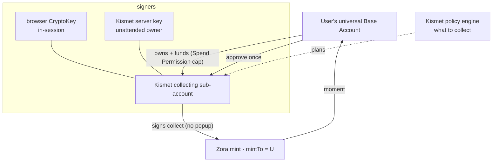

# Sub Accounts — the right foundation for budgeted collecting

> Status: **RESEARCH → DESIGN.** Answers "why not KismetSpender?" and designs the
> best implementation of budgeted auto-collect (Scouts) for Kismet using **Base
> Sub Accounts**. Supersedes the KismetSpender option in `AGENT_BUDGET_DESIGN.md`.
> Reuses the shipped, custody-agnostic Scout engine (`AGENT_SCOUT_FOUNDATION.md`)
> — only the executor changes.
>
> Verified facts: ERC‑7895 (fetched verbatim) + the `coinbase/spend-permissions`
> repo + Base‑docs search summaries. The exact `@base-org/account` sub-account
> calls live on docs.base.org (blocks automated fetch) — **verify those against
> the live SDK before building** (flagged inline).

---

## 1. Why KismetSpender is the wrong call (your instinct was right)

**KismetSpender** = the user signs a Spend Permission naming **Kismet's backend
operator as the `spender`**; that operator pulls USDC *to its own address* and
submits the mint. It works, but it makes Kismet a custodian-in-motion:

| | KismetSpender | **Sub Account** |
| --- | --- | --- |
| Where funds flow | user → **Kismet operator EOA** → mint | stay in the **user's own sub-account**, auto-pulled from parent per tx |
| What Kismet holds | a key that pulls *your* funds to *us* | a **scoped signer on an account the user owns** |
| Who owns the executor | Kismet | **the user** (universal account is an owner) |
| Max loss if our key leaks | the spend cap, sitting in our EOA | the spend cap, and only ever from a **near‑empty user account** |
| Liability / ops | we custody funds in motion, more legal/ops surface | minimal — we never receive user funds |
| Revocation | revoke permission | revoke permission **and/or remove our owner key** |

Same on-chain dollar cap either way — but Sub Accounts deliver it **without Kismet
ever touching user funds**. That's strictly better, so we drop KismetSpender.

---

## 2. How Base Sub Accounts work (researched)

A **Sub Account** is a smart account **owned by the user's universal Base Account**,
provisioned for an app. It's `Spend Permissions + hierarchical ownership +
wallet_addSubAccount (ERC‑7895)`.

- **`wallet_addSubAccount` (ERC‑7895):** an app asks the wallet to create/track a
  sub-account. On `type: "create"`, the wallet **makes the universal account an
  owner** (hierarchy). The app **may provide signing keys**:
  `keys: [{ publicKey, type: "address" | "p256" | "webcrypto-p256" | "webauthn-p256" }]`.
  - **No keys** → the wallet generates a **non-extractable browser CryptoKey** that
    signs for the sub-account *in that session* (client-side, popup-less).
  - **`type: "address"`** → an **EOA the app controls** (e.g. a Kismet server key)
    becomes a sub-account owner — enabling **unattended** signing.
- **Funding — Auto Spend Permissions:** the sub-account spends **directly from the
  parent's balance**; when its own balance is short it **auto-pulls from the parent
  within the spend permission**, no prompt. So it holds ~nothing between txs.
- **Popup-less:** after a one-time setup approval, sub-account transactions need no
  per-action confirmation.
- **SDK surface (`@base-org/account`, verify exact names):** `createBaseAccountSDK({
  appName, appLogoUrl, appChainIds })`; a `subAccounts` config (e.g. `funding:
  'manual'` to disable auto-spend); `sdk.subAccount.{create,get,addOwner,setSigner}`;
  `wallet_addSubAccount` called once per session before use. Users manage sub-accounts
  at **account.base.app**.
- **Not the same as Base MCP.** Sub Accounts are an **app-side** capability (the app
  holds/manages the sub-account signer). The external Base MCP agent does **not** get
  this — it stays per-action (T0). **So Scouts are a Kismet-native feature**, which is
  also where the best UX lives (the Base App mini-app).

---

## 3. The security model (why a scoped key is safe)

The blast radius of the sub-account signer (browser key *or* our server key) is
bounded by construction:

1. **The sub-account is near-empty.** Funds are auto-pulled from the parent **per
   transaction**, only as needed — nothing sits there.
2. **The only funding source is a capped Spend Permission** (allowance / period /
   end). Even a fully-compromised signer can pull at most the remaining cap.
3. **The user owns it.** The universal account is an owner; the user can **remove our
   owner key** and/or **revoke the permission** at account.base.app at any time.
4. **Kismet policy caps "what."** The on-chain cap limits dollars; our Scout policy
   engine limits which collections/creators/price/qty/media (Spend Permissions can't
   restrict the call target). Two independent layers.

Net: max loss = the remaining per-period cap, from a user-owned, revocable account —
not custody of the user's wallet. (Stretch: scope our server key to only the Zora
minters + USDC via session-key permissions if Base exposes per-contract scoping —
**verify**; otherwise the cap + ephemeral-funding + policy is the bound.)

---

## 4. The best implementation for Kismet

One sub-account per user — a **"Kismet collecting account"** — with two execution
contexts that share it. The recipient of every mint is the user's **main account**
(`mintTo = parent`), so agent-collected moments are indistinguishable from
hand-collected ones; the sub-account is purely the **budgeted execution vehicle**.

### 4.1 Provisioning (one approval)

In Kismet (web + Base App mini-app), via the Base Account SDK:
`wallet_addSubAccount({ type: "create" })` (universal account becomes owner) **+** a
Spend Permission for the budget (token=USDC, allowance, period). One user approval
sets up the collecting account and its budget. For unattended Scouts, also add a
**Kismet server key** as an owner (`keys: [{ type: "address", publicKey: <server EOA> }]`)
in the same approval.

### 4.2 Mode A — in-session, popup-less (ship first, zero new trust)

When the user is **in Kismet** (web or mini-app), the **browser CryptoKey** signs
sub-account collects with no popups. The co-pilot collects a basket ("collect these
4", or a Propose set) with **zero taps** after setup. No Kismet-held key at all —
the safest first step, and it makes the present-user experience delightful.

### 4.3 Mode B — unattended Scout (the headline)

For "collect drops while I'm away," the **Kismet server key** (a sub-account owner)
signs collects server-side, **within the Spend Permission cap + the Scout policy**.
This is true autonomy, with the §3 bound. Ship after Mode A proves out.

### 4.4 Execution (both modes)

The sub-account is `msg.sender`; it auto-funds from the parent within the cap, then:
- **USDC:** approve ERC20Minter (sub-account) → `mint(..., mintTo = parent)`.
- **ETH:** `mint{value}(..., mintTo = parent)`.
Reuse the **existing `prepare-collect` / `collectBatch` builders** (so the builder
code + Zora referral + royalties are preserved) and record via the **existing
`/api/collect`**. Gas: a **paymaster** (gasless) — verify Base App sponsorship vs
app-sponsored.

### 4.5 Maps onto the shipped Scout foundation

Nothing in the pure engine changes. The custody-agnostic `ScoutExecutor` seam now
resolves to a **SubAccountExecutor** (browser-key for Mode A, server-key for Mode
B). `planRun` decides *what*; the executor signs the sub-account mint. The budget
accounting already mirrors the Spend Permission period semantics. The seam is
exactly why this pivot costs no rework.

---

## 5. Decisions

1. **Recipient:** `mintTo = parent` (main collection — recommended) vs the
   sub-account (siloed "Kismet collection"). Recommend parent for continuity.
2. **v1 scope:** **Mode A first** (browser key, no Kismet key, popup-less in-session),
   then Mode B (server key, unattended). Recommend this order.
3. **Budget currency:** USDC-only first.
4. **Gas:** confirm paymaster sponsorship path (Base App vs app-sponsored).
5. **Server-key scoping (Mode B):** pursue per-contract session-key scope if Base
   supports it; else rely on cap + ephemeral funding + policy. **Verify.**

## 6. Build plan

| Step | Ships | New |
| --- | --- | --- |
| **A1** | provisioning: create sub-account + USDC Spend Permission (one approval) | `@base-org/account`; a Kismet "collecting account" setup UI; mini-app provider wiring |
| **A2** | in-session popup-less collect / batch / Propose via the sub-account | `SubAccountExecutor` (browser key) behind the seam; wire to `planRun` + `/api/collect` |
| **B1** | unattended Scouts | Kismet server key as sub-account owner; server signer; Scout store + scheduler; dashboard (ledger, pause, revoke) |
| **B2** | curated discovery feeds Scouts | x402 `tier=curated` |

## 7. Verify before building

- Exact `@base-org/account` sub-account API (`subAccounts` config, `addOwner`/
  `setSigner`, providing an `address`-type key) — docs.base.org (currently 403 here).
- Base App **mini-app** support for `wallet_addSubAccount` + the SDK provider
  (today the mini-app uses the Farcaster wagmi connector + injected provider).
- Paymaster / gas sponsorship for sub-account userOps.
- Whether sub-account owner keys can be **contract-scoped** (session-key permissions)
  or are full owners (→ rely on the cap + ephemeral funding).

### Sources
- [ERC‑7895: API for Hierarchical Accounts](https://eips.ethereum.org/EIPS/eip-7895) ([PR #932](https://github.com/ethereum/ERCs/pull/932/files))
- [Use Sub Accounts](https://docs.base.org/base-account/improve-ux/sub-accounts), [Sub‑account reference](https://docs.base.org/identity/smart-wallet/technical-reference/sub-account-reference), [From Session Keys to Sub Accounts](https://blog.base.dev/subaccounts)
- [Use Spend Permissions](https://docs.base.org/base-account/improve-ux/spend-permissions), [`coinbase/spend-permissions`](https://github.com/coinbase/spend-permissions)
- [Base Account SDK](https://github.com/base/account-sdk), [Base Account SDK intro](https://blog.base.dev/base-account-sdk)
